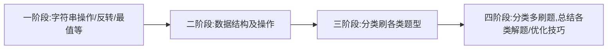

# ALG--practice
每天至少一道 middle 题

## 刷题思路

- 一阶段：熟悉各种常用的 API，熟悉各类常规操作。例如：如何将字符串转为数字、字符数组、数字数组。如何求字符串长度、如何反转字符串、如何求最值。如何初始化指定长度的多位数组。如何按指定要求获取数据、如何按指定要求输出数据等等等等。一定把常用的操作、API使用熟悉。否则上来就刷中等难度的题，即使思路对了。100% 做不对这个题。其次、99% 的时间浪费在查找这个小细节问题上。
- 二阶段：熟悉各类数据结构及操作。比如链表、哈希表、二叉树、栈、堆、队列等等。还要会使用其常规操作。比如建立二叉树、遍历二叉树、使用出栈、入栈等等操作。了解其特性。数据结构是解题的拦路虎，如果你不会使用，有的题根本解不出。
- 三阶段：分类学习各类解题方法。一定要看非常非常非常非常高质量的视频、总结。直接学习，然后再刷响应题目。比如递归、贪心、分治、动态规划、二叉树应用、排序、查找等等。
- 四阶段：开拓视野，总结更多

## 贪心算法
[数组中子数组的最大累乘积](https://github.com/liu12589/ALG--practice/blob/master/%E8%B4%AA%E5%BF%83%E7%AE%97%E6%B3%95/01Maximum_multiplicity_of_subarrays.go)

[分金条的最小花费](https://github.com/liu12589/ALG--practice/blob/master/%E8%B4%AA%E5%BF%83%E7%AE%97%E6%B3%95/02Minimum_cost.go)

[六一儿童节](https://github.com/liu12589/ALG--practice/blob/master/%E8%B4%AA%E5%BF%83%E7%AE%97%E6%B3%95/03ChildrenGift.go)

## 排序
[堆排序](https://github.com/liu12589/ALG--practice/blob/master/%E6%8E%92%E5%BA%8F/Heapsort.go)

[快速排序](https://github.com/liu12589/ALG--practice/blob/master/%E6%8E%92%E5%BA%8F/quickSort.go)

## 动态规划

### 序列型动态规划

[换钱的最少货币个数](https://github.com/liu12589/ALG--practice/blob/master/%E5%8A%A8%E6%80%81%E8%A7%84%E5%88%92%E7%AE%97%E6%B3%95/02minNumberOfMoney.go)

